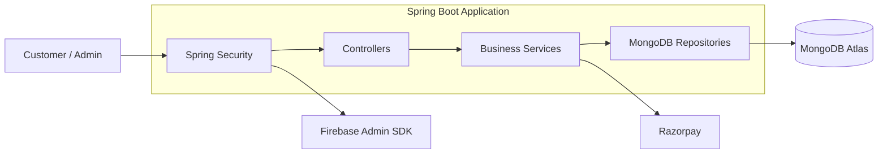

# India Textile Connect

**India Textile Connect** is a Java 21 and Spring Boot e-commerce platform for textile commerce, built around **transactional checkout, inventory consistency, secure authentication, payment validation, and role-based administration**.

The backend is designed to handle the failure cases that matter in commerce systems: **duplicate checkout requests, payment failures, inventory restoration, concurrent state changes, authentication abuse, and inconsistent order states**.

---

## 🛠 Tech Stack

**Java 21** · **Spring Boot 3.2.5** · **Spring Security** · **MongoDB Atlas** · **MongoDB Transactions** · **Razorpay** · **Firebase Admin SDK** · **Thymeleaf** · **Bootstrap 5.3** · **jQuery 3.7** · **Maven**

---

## 🎯 Engineering Highlights

* **Transactional Checkout:** Uses MongoDB multi-document ACID transactions to coordinate order creation and inventory state changes.
* **Inventory Reservation & Recovery:** Reserves stock during checkout and restores inventory when a payment is cancelled, expires, fails, or cannot be completed.
* **Idempotent Checkout:** Uses client-provided idempotency tokens to prevent duplicate orders caused by network retries or repeated checkout requests.
* **Payment Validation:** Validates the payment amount against the server-calculated order total before allowing the order to transition to a paid state.
* **Order State Machine:** Explicitly manages payment and order states such as `PAYMENT_PENDING`, `PAID`, and `CANCELLED`.
* **Concurrency Controls:** Uses synchronized rate-limiting logic and inventory state management to protect sensitive operations from excessive or conflicting requests.
* **Authentication Security:** Supports Firebase phone OTP authentication and username/password authentication through Spring Security.
* **Brute-Force Protection:** Tracks failed login attempts and temporarily blocks accounts after excessive failures.
* **Role-Based Access Control:** Separates customer and administrator capabilities using `USER` and `ADMIN` roles.
* **Data Protection:** Minimizes sensitive information stored in orders and protects credentials using BCrypt hashing.
* **Graceful Admin Failure Handling:** Prevents isolated data-enrichment failures from unnecessarily turning the complete admin dashboard into a server error.

---

# 🏗️ Architecture

India Textile Connect follows a layered Spring Boot architecture with MongoDB as the primary persistence layer.



### Request Flow

```text
Client
  ↓
Spring Security
  ↓
Controller
  ↓
Service Layer
  ↓
MongoDB Repository
  ↓
MongoDB
```

Critical checkout operations execute inside transactional service boundaries.

---

# 🛒 Core Workflows

## 1. Authentication

The platform supports multiple authentication strategies:

```text
                    ┌── Phone OTP ──→ Firebase
                    │
Customer ───────────┤
                    │
                    └── Username/Password
                              ↓
                       Spring Security
                              ↓
                         Authenticated User
```

Security controls include:

* Firebase phone OTP authentication
* Username/password authentication
* BCrypt password hashing
* Spring Security authorization
* Failed-login tracking
* Account lockout after excessive failures
* Active-session controls
* Role-based access control

---

# 2. Transactional Checkout

Checkout is designed around the consistency relationship between **order state and inventory state**.

```text
Customer Checkout
       ↓
Validate Cart
       ↓
Generate / Validate Idempotency Token
       ↓
Calculate Server-Side Total
       ↓
Reserve Inventory
       ↓
Create Order
       ↓
Initiate Payment
       ↓
Payment Result
    ↙       ↘
Success     Failure / Expiry
   ↓              ↓
PAID         Restore Inventory
                  ↓
              CANCELLED
```

The checkout flow uses MongoDB transactions so related database operations can commit or roll back together.

---

# 3. Inventory Safety

Inventory is stored as part of the product data and tracks available sets.

The checkout workflow prevents the application from treating payment and inventory as unrelated operations.

### Successful checkout

```text
Available Stock
      ↓
Stock Reserved
      ↓
Payment Successful
      ↓
Order = PAID
      ↓
Reserved Stock Remains Consumed
```

### Failed checkout

```text
Available Stock
      ↓
Stock Reserved
      ↓
Payment Failed / Expired
      ↓
Transaction / Recovery Logic
      ↓
Inventory Restored
      ↓
Order = CANCELLED
```

This makes payment failure a recoverable business state rather than leaving inventory permanently unavailable.

---

# 4. Idempotent Checkout

Network retries can cause the same checkout request to reach the backend multiple times.

To address this, checkout requires a unique idempotency token.

```text
Request #1
   ↓
idempotencyToken = ABC123
   ↓
Order Creation
   ↓
Request #2
   ↓
idempotencyToken = ABC123
   ↓
Duplicate Request
   ↓
Reject / Prevent Duplicate Order
```

This protects against duplicate order creation when clients retry requests because of timeouts, connection failures, or uncertain payment states.

---

# 5. Payment Validation

Razorpay is used for online payments.

The backend does not rely solely on the amount supplied by the client.

Instead:

```text
Cart
 ↓
Server Calculates Order Total
 ↓
Payment
 ↓
Gateway Amount
 ↓
Server-Side Verification
 ↓
Compare With Internal Total
 ↓
Valid → Continue
Invalid → Cancel / Recover Inventory
```

The checkout service verifies that the payment amount matches the internally calculated order amount before completing the order.

This prevents the client from arbitrarily changing the amount used to complete an order.

---

# 6. Order State Machine

Orders follow explicit lifecycle states rather than relying on loosely coupled boolean flags.

```text
             ┌───────────────┐
             │ PAYMENT_PENDING│
             └───────┬───────┘
                     │
          ┌──────────┴──────────┐
          ↓                     ↓
       PAYMENT               PAYMENT
       SUCCESS               FAILURE
          ↓                     ↓
       PAID                 CANCELLED
```

The order stores the relevant payment and order information needed to preserve the state of the transaction.

Product prices are captured at order creation so later catalog price changes do not alter historical order data.

---

# 🔐 Security Architecture

Security is handled at multiple layers.

## Authentication

* Firebase phone OTP
* Username/password login
* BCrypt password hashing
* Spring Security session management

## Authorization

Two primary roles are supported:

```text
USER
 └── Customer functionality

ADMIN
 └── Administrative functionality
```

Admin-only operations are protected through Spring Security role checks.

## Brute-Force Protection

Failed login attempts are tracked through `LoginAttemptService`.

Repeated failures can result in account blocking through Spring Security's authentication flow.

## Rate Limiting

Sensitive endpoints are protected using a custom token-bucket rate limiter.

The configured implementation supports:

```text
5 tokens / minute
```

Rate-limit state is persisted through MongoDB.

---

# 🧠 Key Engineering Decisions

## MongoDB Transactions

Although MongoDB is a document database, checkout requires coordinated changes across multiple pieces of state.

The application therefore uses MongoDB's multi-document transaction support where atomicity is required.

```text
Transaction
 ├── Validate / reserve inventory
 ├── Create order
 ├── Update related state
 └── Commit
```

If the transaction fails, MongoDB can roll back the participating database operations.

> MongoDB transactions require a replica-set deployment configuration, including for local transactional testing.

---

## Idempotency

Checkout idempotency is implemented at the application layer using a client-generated token.

This protects against duplicate execution caused by:

* Browser retries
* Network timeouts
* Repeated API calls
* Client uncertainty about whether the previous request succeeded

---

## Immutable Order Pricing

Orders retain the product price captured at checkout rather than reading the current catalog price later.

```text
Product Catalog Price
        ↓
Checkout
        ↓
capturedPrice
        ↓
Order
```

Therefore, changing a product's current price does not retroactively modify historical order totals.

---

## Graceful Admin Degradation

The administration dashboard performs additional model enrichment for its views.

Instead of allowing one failed lookup to turn the entire dashboard into a `500` response, bounded error handling allows the application to continue rendering available information and expose the failure for diagnosis.

This keeps administrative workflows usable even when an individual data dependency fails.

---

# 🗄️ Data Model

The primary MongoDB collections include:

| Collection    | Responsibility                                            |
| ------------- | --------------------------------------------------------- |
| `products`    | Product catalog, inventory, media and stock information   |
| `orders`      | Order state, payment information and embedded order items |
| `users`       | Customer/admin accounts and authentication data           |
| `rate_limits` | Rate-limiting state                                       |
| `login_logs`  | Authentication attempt tracking                           |
| `audit_logs`  | Administrative and security-related audit records         |

### Product

Product documents contain information such as:

* Product details
* Category
* Images/videos
* Pricing
* Inventory
* `setsAvailable`

### Orders

Order documents maintain:

* Customer information
* Order items
* Captured product prices
* Order status
* Payment status
* Idempotency token
* Payment information
* Minimized customer data

Embedding order items allows an order to preserve the relevant product state at the time of purchase.

---

# 👤 Data Privacy

The system follows data-minimization principles for order information.

Examples include:

* Storing masked phone information where appropriate
* Protecting credentials using BCrypt hashing
* Separating authentication information from business workflows
* Avoiding unnecessary duplication of sensitive user information in orders

---

# 📊 Admin Dashboard

The admin dashboard provides operational visibility and management capabilities.

Administrators can work with:

* Products
* Categories
* Orders
* Users
* Inventory
* Hubs
* Cart analytics
* Audit logs
* Related entities

Entity relationships are handled during administrative operations.

For example, cascading deletion workflows ensure dependent entities are handled when a parent entity such as a hub is removed.

---

# 🌐 External Integrations

## Razorpay

Used for online payment processing.

The application integrates payment processing with the checkout state machine and performs server-side amount validation.

## Firebase

Firebase Admin SDK is used for phone OTP authentication.

---

# ⚙️ Local Development

## Prerequisites

* JDK 21+
* Maven 3.8+
* MongoDB configured as a replica set
* Firebase project/service account
* Razorpay test credentials

MongoDB replica-set support is required because the checkout implementation uses MongoDB multi-document transactions.

---

## Configuration

Configure the required application properties:

```properties
spring.data.mongodb.uri=mongodb+srv://<user>:<password>@<cluster>.mongodb.net/<db>

firebase.service-account.path=path/to/firebase-adminsdk.json

razorpay.key=rzp_test_YOUR_KEY
razorpay.secret=YOUR_SECRET

app.upload.dir=src/main/resources/static/uploads
```

Never commit production credentials, Firebase service-account files, or Razorpay secrets to the repository.

---

# ▶️ Running the Application

Clone the repository:

```bash
git clone <repository-url>
cd <repository-directory>
```

Build the application:

```bash
mvn clean package
```

Run it:

```bash
mvn spring-boot:run
```

The application will start using the configured Spring Boot server port.

---

# 🧪 Testing

The project should be tested around the workflows where correctness matters most:

### Authentication

* Valid OTP authentication
* Invalid authentication attempts
* Brute-force protection
* Role authorization

### Checkout

* Successful checkout
* Duplicate idempotency token
* Invalid payment amount
* Payment failure
* Payment expiry
* Inventory restoration

### Inventory

* Sufficient stock
* Insufficient stock
* Concurrent checkout attempts
* Inventory state after failed payment

### Security

* Unauthorized admin access
* Excessive login attempts
* Rate-limited requests
* Invalid session/access scenarios

---

# 📁 Project Structure

```text
src/
├── main/
│   ├── java/
│   │   └── ...
│   │       ├── controller/
│   │       ├── service/
│   │       ├── repository/
│   │       ├── model/
│   │       ├── security/
│   │       └── config/
│   │
│   └── resources/
│       ├── templates/
│       ├── static/
│       └── application.properties/
│
├── test/
│   └── ...
│
pom.xml
README.md
```

---

# ⚠️ Engineering Considerations

The following areas should be considered before treating the project as a production-scale commerce platform:

* Distributed rate limiting would require shared coordination across application instances.
* Payment callbacks should remain fully server-verified and idempotent.
* Inventory reservation semantics should be carefully designed for long-running payment sessions.
* Production MongoDB deployments should use appropriate replica-set configuration and monitoring.
* Secrets should be managed through a dedicated secret-management system rather than application configuration files.
* Additional integration and concurrency tests should be added around payment and inventory race conditions.
* Observability can be extended with metrics, structured logging, tracing, and alerting.

These are engineering considerations rather than claims of already-implemented functionality.

---

# 🚀 Future Improvements

* Add comprehensive integration tests for checkout and payment failure scenarios.
* Expand concurrency testing around inventory reservation.
* Introduce distributed rate limiting for horizontally scaled deployments.
* Add structured application metrics and tracing.
* Introduce stronger payment webhook reconciliation.
* Move secrets to managed secret storage.
* Add automated deployment pipelines.
* Introduce versioned database/data migration strategies where required.
* Expand audit coverage for sensitive administrative operations.

---

# Project Focus

India Textile Connect demonstrates practical backend engineering across:

**Java · Spring Boot · Spring Security · MongoDB · Transactions · Idempotency · Inventory Management · Payment Processing · Authentication · Rate Limiting · RBAC · E-commerce Workflows**

The project is intentionally focused on **correctness and failure handling in commerce workflows**, rather than adding architectural complexity without a business requirement.
